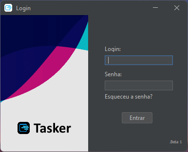
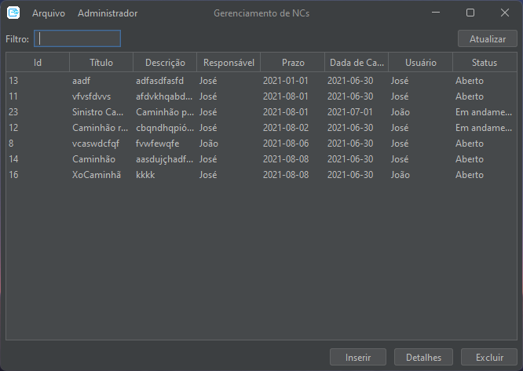
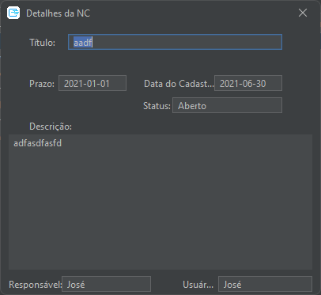
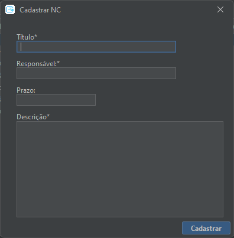
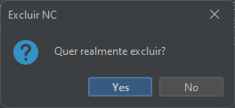
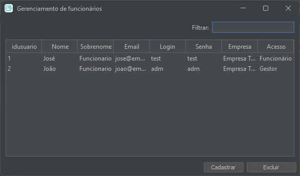
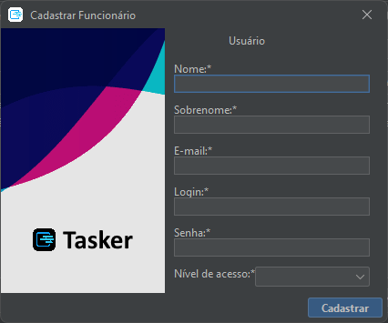
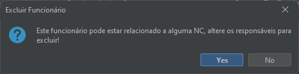

# Tasker - Projeto A3

Tem como propósito criar um MVP de um programinha em Java responsável por organizar não-conformidades. [Apresentação](https://docs.google.com/presentation/d/1hKat4711DHDRkb4IY8QAKSsrt3hfPt-EkbikfLSffA4/edit?usp=sharing).

## Tecnologias

* Java
* flatlaf (para tema)
* swing (componentes)
* Mysql (banco de dados)

## Recursos

* CRUD de não-conformidades
* Acompanhamento das não-conformidades
* CRUD de usuários com níveis de acesso

## Requisitos

* Maven
* Docker
* Java 17^
* GNU/Make(opcional)

## Construir e Executar

1. Instalar as dependencias

```bash
mvn install:install-file -Dfile=./deps/rs2xml.jar -DgroupId=net.proteanit -DartifactId=rs2xml -Dversion=1.0 -Dpackaging=jar
```

2. Construir aplicação

```bash
mvn clean install
mv ./target/tasker-1.0.0-jar-with-dependencies.jar ./target/tasker-1.0.0.jar
```

3. Criar o banco de dados

```bash
docker compose up -d
```

4. Rodar aplicação

```bash
java -jar ./target/tasker-1.0.0.jar
```

## Imagens










## Créditos

* João Sereia
* Lucas Ziman
* Christopher Schmücker
* Gabriel Mohr
